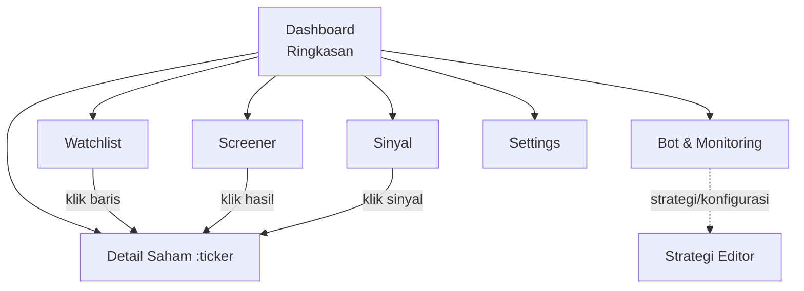
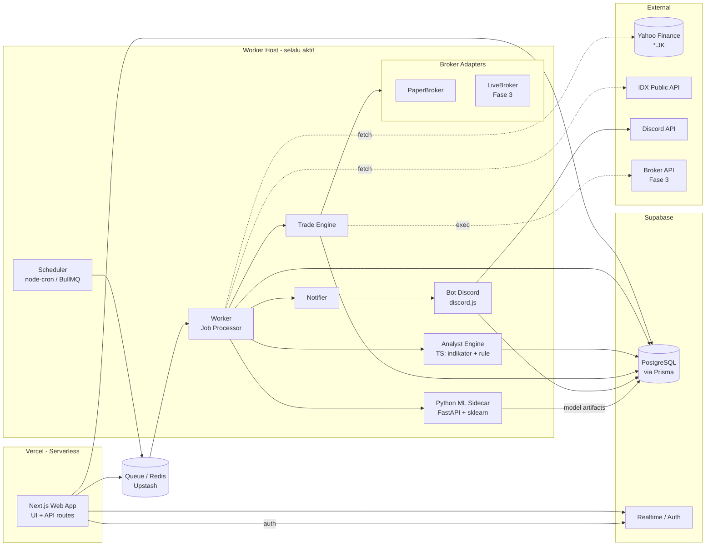
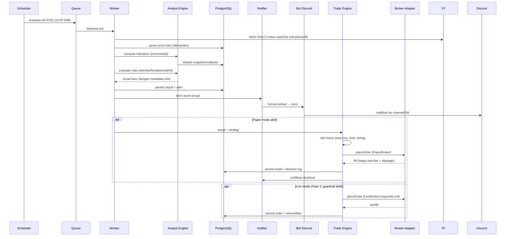
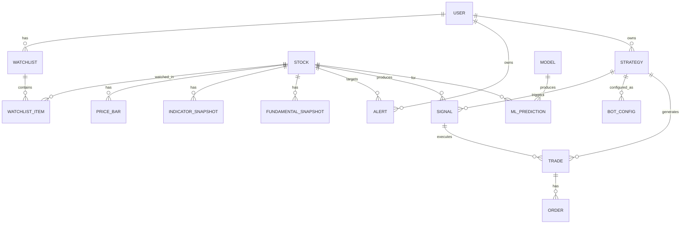
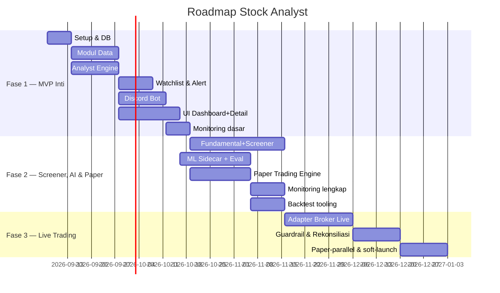

# PRD — Stock Analyst

**Platform Analisis Saham Indonesia (IDX/BEI) + Bot Discord + Auto Trading (Fase Lanjutan)**

| Metadata | Nilai |
|---|---|
| **Dokumen** | Product Requirements Document (PRD) |
| **Versi** | 1.0 (Draft) |
| **Tanggal** | 5 September 2026 |
| **Status** | Draf untuk review — menjadi acuan implementasi |
| **Penulis** | Product & Engineering |
| **Lingkup** | Greenfield, single-user (personal) |
| **Repository** | `d:\all-my-coding-project\stock-analyst` |

---

## Daftar Isi

1. [Ringkasan Eksekutif](#1-ringkasan-eksekutif)
2. [Tujuan & Non-Tujuan](#2-tujuan--non-tujuan)
3. [Persona Pengguna & User Stories](#3-persona-pengguna--user-stories)
4. [Persyaratan Fungsional](#4-persyaratan-fungsional)
5. [Persyaratan UI/UX](#5-persyaratan-uiux)
6. [Persyaratan Bot Discord](#6-persyaratan-bot-discord)
7. [Persyaratan Non-Fungsional](#7-persyaratan-non-fungsional)
8. [Arsitektur Sistem](#8-arsitektur-sistem)
9. [Model Data](#9-model-data)
10. [Detail Tech Stack](#10-detail-tech-stack)
11. [Roadmap & Fase Pengembangan](#11-roadmap--fase-pengembangan)
12. [Metrik Kesuksesan](#12-metrik-kesuksesan)
13. [Risiko & Mitigasi](#13-risiko--mitigasi)
14. [Pertanyaan Terbuka](#14-pertanyaan-terbuka)

---

## 1. Ringkasan Eksekutif

### 1.1 Problem Statement

Investor ritel Indonesia (saham IDX/BEI) kesulitan memantau saham secara **disiplin dan konsisten**: data tersebar, analisis teknikal & fundamental perlu dihitung manual atau lewat platform berbayar, sinyal beli/jual sering terlewat karena tidak ada notifikasi real-time, dan tidak ada mekanisme otomatisasi (paper trading → auto buy/sell) yang aman. Produk komersial (RTI, Stockbit, IDNFinancials) sebagian besar berbayar dan tidak menyediakan notifikasi/otomasi yang dapat dikonfigurasi pengguna.

### 1.2 Proposed Solution

**Stock Analyst** — platform analisis saham IDX pribadi berbasis web (Next.js) dengan:

1. **Dashboard & Screener**: watchlist, chart interaktif + indikator teknikal (MA, RSI, MACD, Bollinger), screener fundamental.
2. **Mesin Sinyal**: engine rule-based teknikal + fundamental + ML ringan yang menghasilkan sinyal beli/jual/watch terstruktur.
3. **Bot Discord**: notifikasi & alert real-time (harga, sinyal, laporan) yang bisa diteruskan ke ponsel, plus perintah slash command.
4. **Auto Trading Engine** (fase lanjutan): paper trading dulu, lalu integrasi broker dengan **risk management & safety guardrail** ketat.

Arsitektur dirancang **broker-agnostic** sejak awal (adapter pattern) agar integrasi broker (Stockbit, Mirage, atau paper trading) tidak mengubah inti sistem.

### 1.3 Success Criteria (KPI Awal)

| # | KPI | Target (6 bulan) |
|---|---|---|
| KPI-1 | Kelengkapan data EOD harian saham IDX yang dipantau (watchlist) | ≥ 95% bar harga tersimpan benar setiap hari bursa |
| KPI-2 | Latensi sinyal → notifikasi Discord | ≤ 30 detik sejak sinyal terdeteksi |
| KPI-3 | Waktu update data pasca penutupan bursa (15:30 WIB) | Selesai ≤ 20 menit setelah close |
| KPI-4 | Akurasi sinyal (backtest kumulatif seluruh strategi aktif) | Profit Factor ≥ 1.3 & Win Rate ≥ 45% pada backtest ≥ 2 tahun |
| KPI-5 | Uptime bot & pipeline | ≥ 99% selama jam bursa (09:00–15:30 WIB, Senin–Jumat) |
| KPI-6 | Sinyal yang terlewat (missed signal) saat jam bursa | 0 kejadian (dengan toleransi downtime tercatat < 1 jam) |
| KPI-7 | Evaluasi model ML (saat tersedia) | F1 ≥ 0.55 pada klasifikasi sinyal holdout set |

> Catatan: untuk pengguna tunggal, "adopsi" tidak diukur; yang diukur adalah **kelengkapan data, ketepatan waktu, kualitas sinyal, dan ketersediaan sistem**.

---

## 2. Tujuan & Non-Tujuan

### 2.1 Goals

| Kode | Goal | Prioritas |
|---|---|---|
| G-01 | Menyediakan data harga harian saham IDX (OHLCV) yang bersih, konsisten, dan historis ≥ 2 tahun dari sumber gratis. | P0 |
| G-02 | Menyediakan analisis teknikal otomatis (MA, EMA, RSI, MACD, Bollinger, dll) untuk setiap saham & timeframe. | P0 |
| G-03 | Menyediakan screening fundamental dasar (valuasi & laporan keuangan) dengan peringatan atas keterbatasan data. | P1 |
| G-04 | Menghasilkan sinyal terstruktur (rule-based) dan menyampaikannya via Dashboard & Discord ≤ 30 detik. | P0 |
| G-05 | Membangun UI dashboard yang menampilkan watchlist, chart, sinyal, dan status bot secara real-time. | P0 |
| G-06 | Membangun engine paper trading yang lengkap (eksekusi simulasi, PnL, risk management) sebagai landasan auto trade. | P1 |
| G-07 | Menyediakan arsitektur adapter broker agar integrasi auto buy/sell (live) tidak memerlukan perubahan arsitektur. | P1 (desain) / P2 (implementasi live) |
| G-08 | Menerapkan observability (log, metrik, alert) sehingga sistem single-user tetap mudah dipantau. | P1 |
| G-09 | Melatih/mengevaluasi model ML ringan untuk membantu sinyal (opsional, pendukung, bukan pengganti rule-based). | P2 |

### 2.2 Non-Goals (sengaja TIDAK dikerjakan dulu)

| Kode | Non-Goal | Alasan |
|---|---|---|
| NG-01 | Dukungan multi-user/SaaS, role, dan billing. | Produk personal; tidak menambah kompleksitas auth & tenancy. |
| NG-02 | Data real-time intraday tick-by-tick / Level 2 / order book. | Sumber data gratis IDX tidak menyediakan ini secara andal; fokus EOD + quote delay. |
| NG-03 | Auto-trade **live** pada Fase 1–2. | Belum ada broker API & belum cukup validasi strategi; wajib lewat paper trading dulu. |
| NG-04 | Pasar non-IDX (AS, SG, dsb). | Fokus IDX; arsitektur data source boleh di-extend, tapi bukan target. |
| NG-05 | Rekomendasi finansial / nasihat investasi ("beli saham X sekarang"). | Output adalah **sinyal/data**, keputusan tetap di user; hindari klaim advisory. |
| NG-06 | News sentiment/analisis berita real-time. | Data berita Indonesia berbayar/terbatas; dapat menjadi kandidat fase lanjutan. |
| NG-07 | Aplikasi mobile native. | Cukup PWA/responsive web + notifikasi Discord di ponsel. |
| NG-08 | Optimalisasi kecepatan eksekusi low-latency (HFT/arbitrase). | Tidak relevan untuk ritel IDX & API broker. |

---

## 3. Persona Pengguna & User Stories

### 3.1 Persona

| Persona | Deskripsi | Kebutuhan inti |
|---|---|---|
| **P-01 — "Andi", Investor Ritel Aktif (primary)** | Karyawan dengan pekerjaan penuh; trading saham IDX sebagai aktivitas sampingan; memantau 10–25 saham; sering bekerja sehingga tidak bisa selalu menatap layar. | Notifikasi ke ponsel, sinyal terstruktur, minim waktu manual. |
| **P-02 — "Budi", Investor Fundamental jangka panjang** | Lebih fokus valuasi & laporan keuangan; trading jarang; ingin screening & reminder berkala. | Screener fundamental, data valuasi, laporan berkala. |
| **P-03 — "Cici", Pengembang & pemilik sistem (admin/self)** | Ingin melihat apakah bot berjalan, konfigurasi strategi, log, dan performa. Karena single-user, peran ini melekat pada persona di atas. | Monitoring UI, log, konfigurasi, backtest. |

> Karena produk single-user, ketiga persona dapat dimiliki satu orang yang sama; perbedaannya menandai **mode penggunaan** (day-trader ringan vs investor).

### 3.2 User Stories

| ID | Sebagai... | Saya ingin... | Sehingga... | Prioritas |
|---|---|---|---|---|
| US-01 | Andi | menambahkan saham ke watchlist lewat UI maupun Discord | semua saham pantauan terkumpul di satu tempat | P0 |
| US-02 | Andi | melihat chart interaktif dengan overlay indikator teknikal | membaca tren & level sebelum memutuskan | P0 |
| US-03 | Andi | menerima notifikasi Discord saat harga menembus level alert | tidak perlu menatap layar terus-menerus | P0 |
| US-04 | Andi | menerima notifikasi saat muncul sinyal beli/jual dari strategi yang saya aktifkan | tidak melewatkan momen entry/exit | P0 |
| US-05 | Andi | bertanya harga & ringkasan saham via slash command di Discord | cek cepat dari ponsel tanpa buka browser | P0 |
| US-06 | Budi | menjalankan screener fundamental (mis. PBV < 1, ROE > 15%) | menemukan kandidat saham undervalued | P1 |
| US-07 | Andi | menjalankan paper trading dengan strategi yang saya pilih | menguji strategi tanpa risiko uang | P1 |
| US-08 | Cici | melihat dashboard monitoring bot (status, log, riwayat sinyal/trade, PnL) | tahu sistem sehat & strategi berkinerja | P1 |
| US-09 | Andi | mengonfigurasi parameter strategi & risk (stop loss, position sizing, daily limit) | otomasi tetap dalam batas aman | P1 |
| US-10 | Andi | (Fase 3) mengaktifkan auto-execution live dengan guardrail kill-switch | bot mengeksekusi order saat saya tidak bisa | P2 |
| US-11 | Andi | menjalankan backtest strategi terhadap data historis | tahu performa strategi sebelum dipakai live | P1 |
| US-12 | Cici | melihat peringatan bila pipeline data gagal atau bot mati | cepat tahu dan memperbaiki | P1 |

---

## 4. Persyaratan Fungsional

> Konvensi: setiap FR punya ID unik, prioritas (P0/P1/P2), dan **Acceptance Criteria (AC)** yang terukur.
> Legenda prioritas: **P0** = wajib di MVP (Fase 1) · **P1** = Fase 2 · **P2** = Fase 3/opsional.

### 4.1 Modul A — Data & Market Data Service

| ID | Requirement | Prioritas | Acceptance Criteria |
|---|---|---|---|
| FR-DATA-001 | **Abstraksi multi-provider data**: sistem mendukung ≥ 2 provider data (default: Yahoo Finance via `yahoo-finance2`; kandidat lain: Twelve Data, IDX publik API) dipilih via konfigurasi, dengan failover otomatis. | P0 | (1) Provider diimplementasikan sebagai interface tunggal `MarketDataProvider`. (2) Bila provider utama gagal/rate-limited, sistem otomatis mencoba provider cadangan. (3) Kegagalan tercatat di log. (4) Menambah provider baru hanya menambah 1 modul, tanpa ubah modul lain. |
| FR-DATA-002 | **Fetch & simpan harga historis OHLCV** untuk ticker IDX (format `BBCA.JK`) dengan interval harian (dan opsi 1D/1W/1M untuk chart). | P0 | (1) Backfill awal ≥ 2 tahun data per ticker berhasil. (2) Data disimpan idempoten (upsert by ticker+timestamp), tidak ada duplikasi. (3) Saham tanpa data (delisted/salah ticker) dilaporkan dengan status jelas. |
| FR-DATA-003 | **Pipeline EOD harian otomatis**: setelah penutupan bursa IDX (15:30 WIB), sistem mengambil & memperbarui seluruh ticker watchlist. | P0 | (1) Job terjadwal setiap hari bursa pukul ±16:00 WIB (dapat dikonfigurasi). (2) Proses selesai ≤ 20 menit untuk ≤ 100 ticker. (3) Sinyal baru yang muncul dari data terbaru diproses otomatis. (4) Tidak berjalan di akhir pekan/hari libur (kalender bursa IDX). |
| FR-DATA-004 | **Quote real-time/delayed** untuk harga terkini (per ticker, sesuai ketersediaan sumber). | P0 | (1) `/price` dan halaman detail menampilkan harga terkini + timestamp data + status (realtime/delayed). (2) UI menampilkan label "data delayed ±15–20 menit" bila sumber tidak real-time. |
| FR-DATA-005 | **Kalender bursa IDX & jam perdagangan** (termasuk libur nasional & half-day). | P1 | (1) Setidaknya pengecekan hari kerja Senin–Jumat otomatis + daftar libur yang dapat dikonfigurasi manual. (2) Pipeline tidak jalan saat libur. |
| FR-DATA-006 | **Normalisasi & validasi data** (harga 0/negatif, split, dividen, outlier). | P0 | (1) Data yang tidak valid ditolak & dicatat. (2) Deteksi anomali besar (mis. lonjakan > 50% tanpa corporate action) memicu peringatan log. (3) Penyesuaian split/dividen (adjusted close) ditangani sesuai data provider. |
| FR-DATA-007 | **Penanganan rate limit & retry** (backoff eksponensial + jitter). | P0 | (1) Setiap request provider melalui rate limiter. (2) Retry maksimal 3× dengan backoff; setelah itu gagal → log + alert monitoring. (3) Tidak pernah membanjiri provider (> ambang yang dikonfigurasi per menit). |
| FR-DATA-008 | **Sinkronisasi profil saham** (nama, sektor, papan, status). | P1 | (1) Data master saham dapat di-refresh dari sumber (Yahoo/IDX). (2) UI menampilkan nama & sektor Indonesia bila tersedia. |

**Keterbatasan data IDX pada sumber gratis (wajib dikomunikasikan di UI):**
- Yahoo Finance untuk `*.JK` umumnya **delayed** (bukan tick real-time) dan cakupan **fundamental tidak lengkap/tidak konsisten**; laporan keuangan tidak selalu tersedia.
- API publik IDX (endpoint internal situs `idx.co.id` yang dipakai pustaka pihak ketiga) **tidak resmi**, dapat berubah sewaktu-waktu, dan umumnya hanya menyediakan data daftar saham & sebagian data ringkas, bukan OHLCV historis penuh.
- Intraday historis untuk IDX sangat terbatas di sumber gratis; **timeframe utama yang didukung penuh adalah harian**.
- Data korporasi (right issue, stock split) kadang terlambat/inkonsisten antar provider → perlu validasi (FR-DATA-006).

### 4.2 Modul B — Analisis Teknikal

| ID | Requirement | Prioritas | Acceptance Criteria |
|---|---|---|---|
| FR-TA-001 | **Kalkulasi indikator inti**: SMA, EMA, RSI, MACD, Bollinger Bands, Volume (incl. rata-rata volume), ATR, Stochastic. | P0 | (1) Nilai indikator dihitung dari data OHLCV tersimpan (bukan langsung dari provider tiap kali dibuka). (2) Hasil cocok dengan referensi (mis. uji unit terhadap contoh data yang dihitung manual/verifikasi terhadap library referensi) dengan toleransi ≤ 0.5%. (3) Indikator tersedia per timeframe yang didukung. |
| FR-TA-002 | **Sinyal teknikal rule-based** (crossing & kondisi) berbasis indikator di atas. | P0 | (1) Contoh aturan terdefinisi: Golden/Death Cross MA, RSI oversold/overbought (<30/>70), MACD cross, break out Bollinger. (2) Sinyal punya metadata lengkap (tipe, arah, harga referensi, alasan/rule yang terpenuhi). (3) Aturan dapat diaktifkan/nonaktifkan per ticker. |
| FR-TA-003 | **Rekalkulasi bertahap (incremental)**: hanya bar terakhir (dan window indikator) yang dihitung ulang pada update EOD, tanpa mengulang seluruh riwayat. | P1 | (1) Update harian untuk 100 ticker dengan 10 indikator selesai ≤ 5 menit. (2) Hasil konsisten dengan perhitungan penuh (uji kesetaraan). |
| FR-TA-004 | **Penyimpanan snapshot indikator** per ticker per hari untuk keperluan screener/query cepat. | P1 | (1) Snapshot harian tersimpan & dapat di-query rentang waktu. (2) Screener teknikal (mis. RSI<30, MACD bull) menggunakan snapshot, bukan hitung ulang runtime. |

### 4.3 Modul C — Screening Fundamental

| ID | Requirement | Prioritas | Acceptance Criteria |
|---|---|---|---|
| FR-FUND-001 | **Data fundamental inti**: harga/ekuitas (PBV), PER, ROE, EPS, laba bersih & pendapatan (YoY), dividen yield, market cap. | P1 | (1) Field diisi dari sumber tersedia (Yahoo + sumber IDX bila ada) dengan atribut `source` & `asOfDate`. (2) Data yang tidak tersedia ditampilkan sebagai "N/A" dengan alasan, bukan nilai palsu. (3) Sinkronisasi terjadwal (mingguan / saat laporan). |
| FR-FUND-002 | **Screener fundamental** dengan filter kombinasi & hasil dapat diurutkan. | P1 | (1) Filter: rentang PBV, PER, ROE, dividen yield, market cap, sektor, growth. (2) Kombinasi filter arbitrer; hasil ≤ 3 detik untuk 900+ saham IDX. (3) Hasil ekspor CSV. (4) Kandidat dapat ditambahkan langsung ke watchlist. |
| FR-FUND-003 | **Screener teknikal** (berbasis snapshot FR-TA-004) terintegrasi dalam satu halaman. | P1 | (1) Filter teknikal: RSI, kondisi MACD, posisi vs MA, volume surge. (2) Dapat dikombinasikan dengan filter fundamental. |
| FR-FUND-004 | **Screener tersimpan** & dapat dijalankan via Discord. | P1 | (1) User dapat menyimpan preset screener (nama + konfigurasi). (2) Preset dapat dijalankan via `/screener`. |
| FR-FUND-005 | **Peringatan kualitas data fundamental**: nilai dilaporkan dengan kepercayaan (confidence) & sumber agar tidak menyesatkan. | P1 | (1) Setiap nilai fundamental menampilkan asal & tanggal. (2) Bila dua sumber berbeda > 10%, sistem menandai konflik & memilih sumber dengan prioritas terkonfigurasi. |

### 4.4 Modul D — AI/ML Sinyal

| ID | Requirement | Prioritas | Acceptance Criteria |
|---|---|---|---|
| FR-ML-001 | **Pendekatan bertahap**: (a) rule-based dulu (Fase 1), (b) ML ringan sebagai lapisan pendukung/skor (Fase 2). ML TIDAK menggantikan rule-based, melainkan menambah sinyal "AI" dengan skor probabilitas. | P1 | (1) Sinyal AI selalu menyertakan skor probabilitas & feature importance/laporan alasan sederhana. (2) Ada saklar global & per-ticker untuk mengaktifkan lapisan AI. |
| FR-ML-002 | **Fitur (features) ML terdefinisi & dapat dihitung ulang**: return N-hari, RSI, MACD histogram, slope MA, volatilitas, volume relatif, dsb (window 5/10/20/60 hari). | P1 | (1) Feature engineering sebagai fungsi deterministik dari data tersimpan. (2) Pipeline training/backfill feature tersedia. |
| FR-ML-003 | **Rekomendasi model awal yang realistis**: klasifikasi sinyal (label: naik/turun dalam horizon H hari) dengan **scikit-learn** (Python sidecar) — pilihan: Logistic Regression, Random Forest, atau Gradient Boosting kecil; atau alternatif TS sederhana (rule + regresi linier/logistik ringan) bila sidecar Python tidak diinginkan. | P1 | (1) Model pertama: klasifikasi biner horizon 1–5 hari dengan ~15 fitur. (2) Evaluasi: precision/recall/F1, confusion matrix, dibandingkan terhadap baseline (majority class & rule-based). (3) Jika F1 < 0.55 pada holdout, model **tidak diaktifkan** ke produksi (default aman). |
| FR-ML-004 | **Anti-overfitting & walk-forward validation**: train/test temporal (bukan acak). | P1 | (1) Split berdasar waktu (train lama, test baru) + walk-forward minimal 2 lipatan. (2) Tidak ada data bocor (look-ahead) — fitur hanya memakai data sampai hari sinyal. (3) Uji backtest mensimulasikan keterlambatan data. |
| FR-ML-005 | **Registry model & versioning**: model terlatih disimpan dengan versi, tanggal training, metrik, dan status aktif. | P2 | (1) Setiap artefak model punya ID/versi & metrik tersimpan. (2) Rollback ke versi sebelumnya mudah (1 klik / 1 perintah). |
| FR-ML-006 | **Retraining terjadwal** dengan peringatan drif/penurunan performa. | P2 | (1) Retraining berkala (mis. bulanan) terjadwal. (2) Jika performa live turun di bawah ambang vs backtest, sistem menandai model untuk review. |

**AI System Requirements — Tooling & Evaluasi:**

| Aspek | Spesifikasi |
|---|---|
| Tools/API yang dibutuhkan | Python 3.11+ (FastAPI sidecar), `scikit-learn`, `pandas`, `numpy`, `joblib`/`onnx`; pada sisi TS: modul feature engine & client HTTP ke sidecar. |
| Dataset evaluasi | Seluruh riwayat OHLCV tersimpan (≥ 2 tahun) per ticker; label dari return masa depan dengan biaya transaksi & slippage diasumsikan. |
| Metrik | Precision@signal, Recall, F1, profit factor hasil backtest, kalibrasi probabilitas (Brier score). |
| Threshold aktivasi produksi | F1 ≥ 0.55 (holdout walk-forward) DAN backtest profit factor ≥ 1.2 setelah biaya; jika tidak terpenuhi, sinyal AI berstatus "eksperimental" dan tidak dikirim ke notifikasi default. |
| Human-in-the-loop | Setiap sinyal AI yang dikirim ke Discord berlabel "AI" dengan skor; user dapat memberi umpan balik (benar/salah) yang disimpan untuk evaluasi selanjutnya. |

### 4.5 Modul E — Watchlist & Alert

| ID | Requirement | Prioritas | Acceptance Criteria |
|---|---|---|---|
| FR-ALERT-001 | **Kelola watchlist** (CRUD grup saham & item). | P0 | (1) Buat/hapus/ganti-nama watchlist. (2) Tambah/hapus saham via UI & Discord `/watch`. (3) Max item per watchlist = 100 (konfigurasi). (4) Validasi ticker sebelum simpan. |
| FR-ALERT-002 | **Alert harga** (naik/turun menembus level, atau keluar rentang) per ticker. | P0 | (1) User membuat alert: `harga ≥ X`, `harga ≤ Y`, `breakout channel`. (2) Alert dievaluasi setiap data baru masuk (EOD & quote refresh). (3) Saat terpenuhi → notifikasi Discord + tersimpan di riwayat alert. (4) Alert sekali-pakai atau berulang sesuai konfigurasi. |
| FR-ALERT-003 | **Alert sinyal** — notifikasi otomatis saat strategi/rule menghasilkan sinyal beli/jual untuk ticker watchlist. | P0 | (1) Sinyal dari modul B/D yang cocok dengan preferensi user memicu alert. (2) Deduplikasi: sinyal arah yang sama pada ticker yang sama tidak berulang dalam 1 sesi/1 hari (cooldown konfigurabel). (3) User dapat memilih jenis sinyal yang ingin dinotifikasi per watchlist. |
| FR-ALERT-004 | **Preferensi notifikasi** per user: saluran (Discord channel/DM), jenis event, jam tenang (quiet hours). | P0 | (1) Preferensi tersimpan. (2) Tidak ada notifikasi keluar saat quiet hours kecuali event kritis (mis. order tereksekusi / error bot). |
| FR-ALERT-005 | **Riwayat alert** dapat dilihat di UI & Discord. | P1 | (1) Riwayat alert 90 hari dapat difilter (ticker, tipe, status). (2) `/alerts` menampilkan 10 alert terakhir. |

### 4.6 Modul F — Discord Bot

| ID | Requirement | Prioritas | Acceptance Criteria |
|---|---|---|---|
| FR-BOT-001 | **Bot Discord aktif 24/7** (service terpisah dari Vercel). | P0 | (1) Bot online & merespons ping dalam ≤ 2 detik (kecuali rate limit Discord). (2) Uptime ≥ 99% selama jam bursa (lihat NFR). |
| FR-BOT-002 | **Slash commands inti**: `/watch`, `/unwatch`, `/price`, `/signal`, `/screener`, `/alerts`, `/help`. | P0 | (1) Setiap command terdaftar via Discord command registry (global/guild). (2) Respon command ≤ 3 detik (defer + follow-up bila komputasi lama). (3) Validasi input ticker (format `.JK` atau tanpa suffix → otomatis `.JK`). (4) Error ditampilkan ramah. |
| FR-BOT-003 | **Notifikasi push** (channel yang dikonfigurasi & DM ke owner): alert harga, sinyal, laporan EOD, peringatan sistem. | P0 | (1) Format pesan konsisten (embed) — lihat Bagian 6. (2) DM hanya ke user owner (ID terkonfigurasi). (3) Channel tujuan dapat dipilih via `/settings` atau konfigurasi. |
| FR-BOT-004 | **Binding owner**: hanya pemilik (Discord user ID) yang dapat memakai command administratif. | P0 | (1) Command admin (mis. `/bot start|stop`, `/settings`) ditolak untuk user lain dengan pesan jelas. (2) Command baca publik boleh untuk anggota server lain (opsional: batasi ke channel tertentu). |
| FR-BOT-005 | **Laporan EOD terjadwal**: ringkasan harian otomatis (harga watchlist, sinyal hari ini, PnL paper). | P1 | (1) Laporan terkirim setiap hari bursa setelah pipeline selesai. (2) Format ringkas & dapat dibaca mobile. |
| FR-BOT-006 | **Interupsi & restart aman** (reconnect, resume session Discord). | P0 | (1) Bot menangani disconnect & reconnect otomatis dengan backoff. (2) Pesan yang gagal terkirim (antrean keluar) dikirim ulang saat kembali online (max retry terkonfigurasi). |
| FR-BOT-007 | **Rate limit Discord** dihormati (bucketing & antrean per channel). | P0 | (1) Tidak pernah menerima 429 yang tidak tertangani; antrean internal per channel. (2) Batch notifikasi besar di-throttle. |

### 4.7 Modul G — Auto Trading Engine (Paper → Live)

> **Prinsip utama**: engine sinyal dan engine eksekusi dipisah secara tegas. Mode **Sinyal-saja** → **Paper** → **Live** hanya beda pada "execution adapter".

| ID | Requirement | Prioritas | Acceptance Criteria |
|---|---|---|---|
| FR-TRADE-001 | **Konsep strategi** (konfigurasi trading): ticker/daftar, arah, aturan entry/exit (dari sinyal modul B/D), target, risk params, jadwal. | P1 | (1) Strategi CRUD via UI; satu strategi = satu konfigurasi lengkap. (2) Strategi dapat diaktifkan/dinonaktifkan per mode. (3) Setiap perubahan versi strategi tercatat (audit). |
| FR-TRADE-002 | **Mode operasional**: `SIGNAL_ONLY` → `PAPER` → `LIVE` (gated oleh konfigurasi; LIVE hanya Fase 3). | P1 | (1) Satu strategi yang sama dapat dijalankan di mode berbeda untuk perbandingan. (2) Perpindahan ke LIVE memerlukan konfirmasi eksplisit + checklist guardrail (lihat FR-TRADE-009). (3) Mode LIVE nonaktif secara default. |
| FR-TRADE-003 | **Paper trading engine**: eksekusi simulasi order pada harga pasar/data, saldo virtual, komisi asumsi, posisi, PnL. | P1 | (1) Order dieksekusi pada harga bar berikutnya (next-bar open) atau harga dengan slippage asumsi, bukan harga saat sinyal (anti look-ahead). (2) Komisi & pajak (jika ada) dimodelkan. (3) Saldo & posisi paper persist & akurat. (4) Paper equity curve dapat dilihat di monitoring. |
| FR-TRADE-004 | **Risk management wajib** (berlaku paper & live): stop loss, take profit, position sizing (% modal / risk-based), max posisi paralel, daily loss limit, max order per hari. | P1 | (1) Parameter default aman ter-set dan **tidak bisa kosong**. (2) Aturan dievaluasi setiap bar/sinyal. (3) Pelanggaran limit (mis. daily loss) menghentikan strategi & mengirim alert. |
| FR-TRADE-005 | **Guardrail & kill-switch** (manual + otomatis): stop seluruh aktivitas otomasi instan. | P1 | (1) Kill-switch via UI, Discord `/stop`, dan tombol darurat. (2) Kill-switch otomatis pada kondisi: daily loss limit, error beruntun (N×), koneksi data terputus > X menit, anomali harga. (3) Setelah kill-switch, hanya intervensi manual yang dapat menyalakan kembali. (4) Semua aksi kill tercatat dengan timestamp & alasan. |
| FR-TRADE-006 | **Sinkronisasi status order & posisi** dengan sumber eksekusi (paper ledger atau broker). | P1 | (1) Status order (pending/filled/rejected/canceled) konsisten. (2) Rekonsiliasi otomatis berkala; selisih memicu alert. (3) Tidak ada double-execution (idempotensi order ID). |
| FR-TRADE-007 | **Arsitektur adapter broker** (pluggable): `BrokerAdapter` interface — implementasi PaperBroker (selalu ada) & broker live (Fase 3: kandidat Stockbit/Mirage/pihak ketiga/API ritel). | P1 (desain) / P2 (live) | (1) Interface: placeOrder, cancelOrder, getPositions, getAccount, getOrderStatus. (2) Trade engine tidak bergantung pada implementasi broker tertentu. (3) Paper broker tersedia sejak Fase 2. |
| FR-TRADE-008 | **Integritas & idempotensi**: setiap keputusan eksekusi punya ID unik; tidak ada order ganda akibat retry. | P1 | (1) Setiap intent order punya `requestId` unik yang dipertahankan saat retry. (2) Log keputusan (decision log) mencatat alasan penuh setiap order. |
| FR-TRADE-009 | **Checklist aktivasi LIVE** (hanya Fase 3): backtest & paper validated, guardrail aktif, batas risiko terkonfigurasi, kill-switch teruji. | P2 | (1) Aktivasi LIVE menampilkan checklist yang harus tercentang. (2) Batas maksimum nominal order/posisi per hari wajib diisi sebelum LIVE diizinkan. (3) Ada mode "paper-parallel" yang membandingkan keputusan paper vs live untuk deteksi drift. |
| FR-TRADE-010 | **Audit trail lengkap** semua keputusan engine (waktu, mode, strategi, alasan, params). | P1 | (1) Setiap keputusan (sinyal→order→fill/reject) tersimpan immutable. (2) Dapat ditelusuri dari UI monitoring. |

### 4.8 Modul H — Monitoring & Logging

| ID | Requirement | Prioritas | Acceptance Criteria |
|---|---|---|---|
| FR-MON-001 | **Dashboard status bot/worker**: status service (running/stopped/error), uptime, heartbeat. | P1 | (1) Halaman monitoring menampilkan status real-time tiap service (web ok, bot, scheduler, worker). (2) Heartbeat per service ≤ 60 detik; status stale > 2 menit ditandai merah. (3) Status juga dapat dicek via Discord `/bot status`. |
| FR-MON-002 | **Riwayat sinyal & alert** dapat difilter & dicari. | P1 | (1) Tabel sinyal (ticker, arah, sumber rule/model, harga, waktu, status). (2) Filter waktu/ticker/jenis. |
| FR-MON-003 | **Riwayat trade & PnL** (paper & live): equity curve, per-trade breakdown, drawdown, perbandingan vs benchmark (IHSG). | P1 | (1) Grafik equity & drawdown. (2) Metrik: total return, profit factor, win rate, avg win/loss, max drawdown. (3) Perbandingan vs IHSG pada periode sama. |
| FR-MON-004 | **Log terpusat** dengan level & pencarian; rotasi & retensi. | P1 | (1) Semua service menulis log terstruktur (JSON) dengan `service`, `level`, `timestamp`, `context`. (2) Log dapat difilter di UI atau file; retensi ≥ 30 hari. (3) Error severity (warn/error) tampil menonjol. |
| FR-MON-005 | **Healthcheck & alert internal**: pipeline gagal, bot mati, rate-limit jenuh, dsb → notifikasi Discord (channel admin). | P1 | (1) Kondisi berikut memicu alert dalam ≤ 5 menit: fetch data gagal 3× beruntun, bot offline > 2 menit, order engine error. (2) Alert terkirim ke channel admin yang terpisah dari notifikasi trading. |

### 4.9 Modul I — UI Dashboard

| ID | Requirement | Prioritas | Acceptance Criteria |
|---|---|---|---|
| FR-UI-001 | **Halaman Watchlist**: daftar saham dengan harga, perubahan %, indikator mini, & sinyal terbaru; dapat diurutkan/filter. | P0 | (1) Memuat ≤ 2 detik untuk 100 item (data tersimpan/SSR, tanpa panggilan provider per render). (2) Perubahan % hijau/merah sesuai konvensi IDX (lihat catatan). (3) Sinkron otomatis/periode refresh terkonfigurasi. |
| FR-UI-002 | **Halaman Detail Saham**: chart candlestick interaktif + overlay indikator + panel sinyal & alert + info fundamental ringkas. | P0 | (1) Chart mendukung timeframe 1D/1W/1M & toggle indikator (MA/EMA/RSI/MACD/BB) — subchart RSI/MACD. (2) Crosshair menampilkan OHLC + nilai indikator. (3) Panel "Sinyal terakhir" dengan alasan rule. (4) Tombol tambah alert & ke watchlist langsung dari halaman ini. |
| FR-UI-003 | **Halaman Screener**: filter fundamental & teknikal kombinasi, tabel hasil, ekspor. | P1 | (1) Filter dinamis kombinasi (lihat FR-FUND-002/003). (2) Hasil ≤ 3 detik untuk universe IDX. (3) Save preset & jalankan via Discord. |
| FR-UI-004 | **Halaman Sinyal**: feed & riwayat sinyal seluruh strategi, filter, aksi (masuk watchlist, buat alert). | P1 | (1) Feed real-time (polling/realtime) dengan badge sumber (Teknikal/Fundamental/AI/Paper). (2) Filter by ticker/jenis/sumber. |
| FR-UI-005 | **Halaman Bot & Monitoring**: status service, log viewer, riwayat trade, PnL & equity, konfigurasi strategi & bot. | P1 | (1) Semua kemampuan FR-MON-001..005 tersedia. (2) Konfigurasi strategi (CRUD) & kill-switch manual. (3) Tabel riwayat trade & grafik equity. |
| FR-UI-006 | **Halaman Settings**: koneksi Discord, channel tujuan, preferensi notifikasi, mode bot, data source, jam tenang. | P1 | (1) Setiap perubahan tersimpan & langsung berlaku tanpa redeploy. (2) Status koneksi Discord tampil (connected/disconnected). |
| FR-UI-007 | **Responsif & PWA**: dapat dipakai di ponsel (view-only dasar). | P2 | (1) Layout adaptif ≤ 768px tanpa rusak. (2) Manifest PWA tersedia (opsional install). |
| FR-UI-008 | **Aksesibilitas dasar & konvensi warna**: tidak hanya mengandalkan warna untuk informasi penting. | P2 | (1) Perubahan harga disertai simbol panah/teks (±), bukan hanya warna. (2) Kontras teks memenuhi WCAG AA. |

> **Catatan konvensi warna IDX**: di Indonesia, **hijau = naik, merah = turun** (kebalikan konvensi AS). Sistem wajib memakai konvensi IDX secara konsisten dan dapat dikonfigurasi.

---

## 5. Persyaratan UI/UX

### 5.1 Peta Halaman & Navigasi



- Navigasi utama: **sidebar** (desktop) / **bottom bar** (mobile).
- Tema: dark mode default (nyaman untuk chart), light mode opsional.
- Bahasa UI: **Bahasa Indonesia** (angka & label), istilah teknikal tetap disertai istilah asing dalam tanda kurung bila perlu.

### 5.2 Deskripsi Wireframe per Halaman (tekstual)

**Halaman 1 — Dashboard (Ringkasan)**

```
┌──────────────────────────────────────────────────────────────┐
│ Sidebar │  Header: pencarian ticker  •  status bot ● ● ●      │
│         ├────────────────────────────────────────────────────┤
│         │  Kartu ringkasan: IHSG, total watchlist, sinyal     │
│         │  hari ini, PnL paper (jika aktif)                   │
│         │  ┌────────────┐ ┌───────────────────────────────┐   │
│         │  │ Watchlist  │ │ Sinyal terbaru (feed)         │   │
│         │  │ mini (top5)│ │ - BBCA  BUY  MA Cross 14:00   │   │
│         │  │ (tabel)    │ │ - TLKM  SELL RSI<30  16:00    │   │
│         │  └────────────┘ └───────────────────────────────┘   │
│         │  Chart mini IHSG (area) + equity curve paper        │
└──────────────────────────────────────────────────────────────┘
```

- Komponen: kartu status service (3 indikator dot: Web/Bot/Worker), kartu sinyal terbaru, tabel watchlist mini, chart kecil.
- Perilaku: refresh otomatis tiap 60 detik; status service dari heartbeat.

**Halaman 2 — Watchlist**

- Tabel kolom: Ticker, Nama, Harga, Δ% (hari), Δ% (5 hari), RSI, Status sinyal terakhir (badge), Alert aktif (ikon bel), aksi (detail/hapus).
- Toolbar: tambah ticker (modal autocomplete + validasi), filter grup watchlist, filter status sinyal, urutkan per kolom.
- Alur: klik baris → halaman detail. Ikon bel → quick-create alert.

**Halaman 3 — Detail Saham (`/stock/BBCA`)**

```
┌──────────────────────────────────────────────────────────────┐
│ Back  BBCA — Bank Central Asia Tbk     Harga 9.850 ▲ +0.51%  │
│       [Sektor: Financials] [Watchlist ✓] [Tambah Alert]      │
├──────────────────────────────────────────────────────────────┤
│  Toggle timeframe: [1D][1W][1M]   Toggle indikator:          │
│  ┌────────────────────────────────────────────┐  [MA][EMA]   │
│  │        Candlestick chart (lightweight)     │  [RSI][MACD] │
│  │        + overlay volume                     │  [BB]        │
│  ├────────────────────────────────────────────┤              │
│  │  Subchart RSI / MACD (sesuai toggle)       │              │
│  └────────────────────────────────────────────┘              │
│  Tab: [Sinyal] [Fundamental] [Alert]                          │
│   - Sinyal: tabel sinyal historis + alasan rule               │
│   - Fundamental: PBV, PER, ROE, EPS, Yield (label sumber)     │
│   - Alert: daftar alert aktif ticker ini + form baru          │
└──────────────────────────────────────────────────────────────┘
```

- Chart: `lightweight-charts` (candlestick + volume + overlay indikator); subchart terpisah untuk RSI/MACD.
- Label data: "Data: 05 Sep 2026 16:05 WIB — delayed".

**Halaman 4 — Screener**

- Panel filter kiri: grup Fundamental (PBV, PER, ROE, Yield, Market Cap, Sektor), grup Teknikal (RSI range, MACD state, posisi vs MA20/MA50, volume surge), grup umum (watchlist-only, likuiditas).
- Tabel hasil: kolom terurut; tombol "Tambah ke watchlist", "Ekspor CSV".
- Preset tersimpan di dropdown; tombol "Jalankan via Discord" menampilkan contoh perintah.

**Halaman 5 — Sinyal**

- Feed dua panel: kiri daftar sinyal (waktu, ticker, arah, sumber, harga), kanan detail sinyal terpilih (alasan lengkap, konteks chart kecil, aksi).
- Filter: sumber (Teknikal/AI/Paper), arah, ticker, rentang waktu.
- Badge warna arah (hijau BUY / merah SELL) + ikon sumber.

**Halaman 6 — Bot & Monitoring**

- Bagian atas: status card per service + tombol Kill-Switch (merah, konfirmasi).
- Tab: **Log** (viewer filterable), **Sinyal** (riwayat), **Trades** (tabel + PnL), **Strategi** (daftar + editor), **Performa** (equity, drawdown, vs IHSG).
- Editor strategi (modal/panel): pilih ticker, aturan entry/exit, risk params (stop loss %, take profit %, position sizing, daily limit), mode (SIGNAL/PAPER/LIVE), jadwal; menampilkan ringkasan & tombol "Aktifkan".

**Halaman 7 — Settings**

- Bagian: Discord (token/link status, channel notifikasi, channel admin, test notif), Notifikasi (quiet hours, jenis event), Data (provider utama/cadangan, jam pipeline), Bot default (mode global default), Tampilan (konvensi warna naik/turun, tema).

### 5.3 Alur Pengguna Utama (User Flows)

**Alur A — Menambah saham & menerima sinyal (inti):**
```
User menambah BBCA ke watchlist (UI atau /watch BBCA)
   → sistem validasi ticker & fetch data
   → pipeline EOD harian berjalan
   → engine teknikal menghitung indikator & mengevaluasi aturan
   → sinyal BUY terdeteksi
   → alert tersimpan + notifikasi Discord terkirim (≤30 dtk)
   → user membuka notifikasi → klik link → halaman detail BBCA
```

**Alur B — Screener fundamental → watchlist → alert:**
```
User membuka Screener → set filter (PBV<1.5, ROE>15%, PER<12)
   → tabel hasil (≤3 dtk) → klik TLKM → halaman detail
   → tambah ke watchlist → buat alert harga level tertentu
```

**Alur C — Paper trading (Fase 2):**
```
User membuat Strategi "MA-Cross-BBCA" mode PAPER
   → engine memantau sinyal → order simulasi pada bar berikutnya
   → posisi & PnL tercatat → laporan EOD ke Discord
   → user cek performa di Monitoring; kill-switch jika perlu
```

**Alur D — Aktivasi Live (Fase 3, guarded):**
```
User menyiapkan kredensial broker (adapter)
   → checklist aktivasi LIVE (backtest ✓ paper ✓ guardrail ✓ limit ✓)
   → aktifkan mode LIVE → engine hanya jalan bila semua gate lulus
   → setiap order punya decision log & status sinkron broker
   → kill-switch otomatis siap pada pelanggaran risk limit
```

---

## 6. Persyaratan Bot Discord

### 6.1 Daftar Perintah (Slash Commands)

| Command | Deskripsi | Args | Akses | Prioritas |
|---|---|---|---|---|
| `/watch` | Tambah saham ke watchlist | `ticker`, opsional `list` | Owner/anggota | P0 |
| `/unwatch` | Hapus dari watchlist | `ticker` | Owner/anggota | P0 |
| `/price` | Harga & ringkasan singkat | `ticker` | Semua | P0 |
| `/signal` | Sinyal terakhir + status indikator | `ticker` | Semua | P0 |
| `/screener` | Jalankan preset screener | `preset` (dropdown) | Owner/anggota | P1 |
| `/alerts` | Daftar 10 alert/sinyal terbaru | opsional `ticker` | Semua | P1 |
| `/watchlist` | Tampilkan watchlist + ringkasan | opsional `list` | Semua | P1 |
| `/settings` | Lihat/ubah channel & preferensi | `channel` dll. | Owner | P1 |
| `/bot` | Status/kontrol bot & engine | sub: `status`, `start`, `stop` | Owner | P1 |
| `/paper` | Ringkasan PnL & posisi paper | — | Owner | P1 |
| `/help` | Daftar command | — | Semua | P0 |

**Konvensi ticker:** terima `BBCA` maupun `BBCA.JK`; normalisasi internal ke `BBCA.JK`. Daftar ticker dikenal (autocomplete dari data master).

### 6.2 Jenis Event / Notifikasi

| Event | Pemicu | Format | Channel | Prioritas |
|---|---|---|---|---|
| `price_alert` | Alert harga terpenuhi | Embed: ticker, harga, level, Δ% | Channel notifikasi + DM (ops) | P0 |
| `signal_new` | Sinyal rule/AI baru | Embed: arah (badge), rule/alasan, harga, skor AI | Channel notifikasi | P0 |
| `trade_executed` (paper/live) | Order terisi | Embed: arah, qty, harga, strategi, PnL real. | Channel notifikasi | P1 |
| `daily_report` | Laporan EOD | Embed ringkas: ringkasan watchlist, sinyal, PnL | Channel laporan | P1 |
| `system_alert` | Error pipeline/bot/engine | Embed merah: service, pesan, timestamp | Channel admin | P1 |
| `killswitch_triggered` | Kill-switch aktif | Embed merah kritis + instruksi | DM owner + admin channel | P1 |

### 6.3 Format Pesan (Spesifikasi Embed)

- **Judul**: `🟢 BUY — BBCA` / `🔴 SELL — BBCA` / `🟡 WATCH — BBCA` (ikon sesuai arah; hijau/merah konvensi IDX = naik/turun).
- **Field standar**: `Harga`, `Δ% Hari`, `Sinyal dari` (rule/indikator), `Waktu`, `Konfirmasi` (jumlah rule terpenuhi), `Tautan` (URL ke halaman web).
- **Footer**: `Sumber data: Yahoo (delayed ±15 mnt) • ID sinyal: {id}`.
- Pesan mobile-friendly: maks. 5 field per embed; teks singkat.
- **Color code**: hijau `#2ecc71` (buy/naik), merah `#e74c3c` (sell/turun), abu-abu info, kuning peringatan sistem.

### 6.4 Model Permission

| Level | Hak |
|---|---|
| **Owner** (user ID terkonfigurasi di env/DB) | Semua command + DM notifikasi + kontrol bot/engine + settings |
| **Anggota server** (opsional) | Command baca: `/price`, `/signal`, `/watchlist`, `/alerts`, `/help` |
| **Bukan anggota server** | Tidak ada akses (bot menolak interaksi dari luar guild terdaftar) |

Aturan tambahan:
- DM ke bot hanya dilayani untuk user ID owner.
- Command dengan efek tulis (`/watch`, `/screener` preset jalan) bisa dibatasi ke channel tertentu via `/settings`.
- Semua interaksi dicatat (log audit) untuk troubleshooting.

---

## 7. Persyaratan Non-Fungsional

### 7.1 Performa

| ID | Requirement | Target |
|---|---|---|
| NFR-PERF-01 | Waktu muat halaman utama (TTFB + render) | < 2 detik (watchlist 100 item, data tersimpan) |
| NFR-PERF-02 | Query screener fundamental+teknikal pada universe IDX (900+ saham) | ≤ 3 detik |
| NFR-PERF-03 | Rendering chart candlestick + indikator 2 tahun data (≈500 bar) | < 1 detik, interaksi 60 fps |
| NFR-PERF-04 | Latensi sinyal→notifikasi Discord | ≤ 30 detik |
| NFR-PERF-05 | Pipeline EOD 100 ticker | ≤ 20 menit (target ≤ 10 menit) |
| NFR-PERF-06 | Respon slash command | < 3 detik (defer jika komputasi lama) |

### 7.2 Keamanan

| ID | Requirement |
|---|---|
| NFR-SEC-01 | **Secret management**: Discord bot token, DB URL, API key disimpan di env (Vercel env / secret manager service worker), TIDAK pernah di client-side. |
| NFR-SEC-02 | Tidak ada secret di repositori; `.env.example` berisi placeholder; `.env*` di `.gitignore`. |
| NFR-SEC-03 | **Prisma/DB**: koneksi memakai least-privilege role; tidak ada query SQL mentah dari input user (ORM + parameterized). |
| NFR-SEC-04 | Validasi & sanitasi semua input (ticker di-whitelist via regex `^[A-Z0-9]{2,5}(\.JK)?$`, command args). |
| NFR-SEC-05 | Akses admin (halaman Settings, kill-switch, kontrol bot) dilindungi autentikasi (Supabase Auth / password session). |
| NFR-SEC-06 | Rate limiting endpoint publik (pencarian, quote) untuk mencegah abuse. |
| NFR-SEC-07 | (Fase 3) Kredensial broker dienkripsi saat simpan (AES dengan key dari secret manager), tidak pernah dikirim ke client, dan bisa dicabut. |
| NFR-SEC-08 | Audit log: semua aksi sensitif (aktivasi LIVE, kill-switch, ubah settings, hapus data) tercatat siapa/waktu. |
| NFR-SEC-09 | Kebijakan data: data hanya untuk penggunaan pribadi; tidak menjual/mendistribusikan data pihak ketiga; hormati ToS sumber data. |

### 7.3 Reliabilitas

| ID | Requirement |
|---|---|
| NFR-REL-01 | Uptime bot & pipeline ≥ 99% selama jam bursa. |
| NFR-REL-02 | **Idempotensi** seluruh job & eksekusi (retry aman, tanpa duplikasi data/order). |
| NFR-REL-03 | Retry + backoff eksponensial untuk semua panggilan eksternal (data, Discord, broker). |
| NFR-REL-04 | Failover provider data (FR-DATA-001). |
| NFR-REL-05 | Bot Discord auto-reconnect & resume (FR-BOT-006). |
| NFR-REL-06 | Persistence antrean notifikasi: pesan tidak hilang saat service restart (tulis-ke-DB dulu / antrean persisten). |
| NFR-REL-07 | Backup DB terjadwal (Supabase/PG) + verifikasi restore berkala. |
| NFR-REL-08 | Graceful shutdown: worker menyelesaikan/serialisasi pekerjaan saat berhenti. |
| NFR-REL-09 | Timeout eksplisit untuk semua panggilan eksternal agar tidak menggantung. |

### 7.4 Skalabilitas

| ID | Requirement |
|---|---|
| NFR-SCA-01 | Mendukung ≥ 500 ticker dalam pipeline & ≥ 200 alert aktif tanpa degradasi (target beban single-user jauh di bawah ini). |
| NFR-SCA-02 | Desain service stateless (kecuali worker) agar mudah diduplikasi bila perlu. |
| NFR-SCA-03 | Arsitektur dapat diperluas ke multi-user tanpa rombak total (pemisahan data per user dipertimbangkan sejak awal pada skema DB: kolom `ownerId`). |

### 7.5 Observability

| ID | Requirement |
|---|---|
| NFR-OBS-01 | Log terstruktur (JSON) semua service dengan konteks (FR-MON-004). |
| NFR-OBS-02 | Metrik inti: heartbeat service, durasi pipeline, jumlah sinyal/alert/order per hari, error rate, rate-limit hits. |
| NFR-OBS-03 | Alert internal ke Discord admin (FR-MON-005). |
| NFR-OBS-04 | Distributed tracing ringan (correlation id antar service) untuk menelusuri satu sinyal end-to-end. |

---

## 8. Arsitektur Sistem

### 8.1 Komponen & Tanggung Jawab

| Komponen | Host | Tanggung jawab inti |
|---|---|---|
| **Web App (Next.js)** | Vercel (serverless) | UI dashboard + API route (baca/tulis), autentikasi, SSR data. |
| **Bot Service (Discord.js)** | Worker host (selalu aktif) | Slash commands, notifikasi keluar, DM, kontrol bot. |
| **Scheduler** | Worker host | Job terjadwal: pipeline EOD, quote refresh, laporan, retraining ML, healthcheck. |
| **Worker (Job processing)** | Worker host | Menjalankan job berat (fetch data, kalkulasi indikator, evaluasi sinyal, eksekusi paper/live) — dikonsumsi dari antrean. |
| **Analyst Engine (TS lib)** | In-process (web/worker) | Kalkulasi indikator & aturan sinyal (modul B), inti business logic. |
| **Python ML Sidecar (FastAPI)** | Opsional, worker host | Training/inference ML (Fase 2) — `scikit-learn`; jika tidak dipakai, engine TS berjalan sendiri. |
| **Database (Supabase Postgres)** | Supabase | Penyimpanan utama semua entitas (Bagian 9). |
| **Antrean (Queue)** | Upstash Redis / lokal | Job queue + pub/sub notifikasi. **Catatan**: untuk skala single-user, antrean bisa diganti pg-boss/antrean in-DB; BullMQ+Redis direkomendasikan bila ingin pola robust. |
| **Notifier** | Worker host | Format & kirim notifikasi via Bot Service (Discord). |
| **Trade Engine** | Worker host | Evaluasi strategi, risk management, koordinasi adapter eksekusi. |
| **Broker Adapter** | Worker host | Abstraksi eksekusi: `PaperBroker` (selalu), `LiveBroker` (Fase 3). |

> **Arsitektur deploy (berdasarkan pilihan user)**: Web di **Vercel serverless**; semua proses berkelanjutan (bot, scheduler, worker, sidecar) di **satu host kecil** (mis. VPS, Fly.io, Railway, Render, atau PC rumahan) — direkomendasikan VPS/Docker karena membutuhkan proses selalu-aktif & akses Redis.

### 8.2 Diagram Arsitektur



### 8.3 Alur Data End-to-End (Sinyal → Notifikasi → Eksekusi)



### 8.4 Prinsip Desain Kunci

1. **Provider abstraction** untuk data (FR-DATA-001) dan **adapter abstraction** untuk broker (FR-TRADE-007) — dua titik perubahan eksternal paling rapuh diisolasi.
2. **Pemisahan sinyal vs eksekusi** — engine sinyal murni (read data → output signal), engine eksekusi terpisah dengan risk layer; ini memungkinkan mode SIGNAL → PAPER → LIVE hanya dengan mengganti adapter.
3. **Stateless web, stateful worker** — semua pekerjaan berat & berkelanjutan di worker host; web hanya membaca/menulis DB & Redis.
4. **Anti-look-ahead** — keputusan eksekusi hanya memakai data yang tersedia pada saat itu (next-bar execution, lag data).
5. **Idempotensi & audit trail** di semua jalur tulis.

---

## 9. Model Data

> ORM: Prisma (PostgreSQL/Supabase). Semua entitas memiliki `id` (UUID), `createdAt`, `updatedAt`. Multi-user masa depan difasilitasi kolom `ownerId` (nullable; single-user saat ini).

### 9.1 Diagram ER (ringkas)



### 9.2 Tabel Utama & Field Penting

| Tabel | Field penting | Catatan |
|---|---|---|
| **User** | `id`, `email`, `discordUserId`, `timezone` (default `Asia/Jakarta`), `settingsJson` | Single-user; discordUserId untuk binding owner. |
| **Stock** | `ticker` (`BBCA.JK`), `name`, `exchange` (`IDX`), `sector`, `board`, `isActive`, `yahooSymbol` | Master data saham. |
| **PriceBar** | `stockId`, `timestamp` (session date), `open`, `high`, `low`, `close`, `adjClose`, `volume`, `source`, `isAdjusted` | Unique `(stockId, timestamp)`; idempoten. |
| **IndicatorSnapshot** | `stockId`, `date`, `timeframe` (`1D`), `indicatorsJson` (MA, EMA, RSI, MACD, BB, ATR…), `ohlcvRef` | Snapshot harian untuk query cepat (FR-TA-004). |
| **FundamentalSnapshot** | `stockId`, `asOfDate`, `pbv`, `per`, `roe`, `eps`, `revenue`, `netIncome`, `divYield`, `marketCap`, `source`, `confidence` | Data fundamental multi-sumber (FR-FUND). |
| **Watchlist** | `id`, `userId`, `name`, `isDefault`, `notifPrefsJson` | |
| **WatchlistItem** | `watchlistId`, `stockId`, `addedAt`, `note` | Unique `(watchlistId, stockId)`. |
| **Alert** | `id`, `userId`, `stockId`, `type` (`PRICE_ABOVE`/`PRICE_BELOW`/`SIGNAL`/`CHANNEL_BREAK`), `conditionJson` (level, arah), `repeat`, `status` (`ACTIVE`/`TRIGGERED`/`DISABLED`), `lastTriggeredAt` | |
| **Signal** | `id`, `stockId`, `strategyId?`, `source` (`TECHNICAL`/`FUNDAMENTAL`/`AI`/`RULE`), `direction` (`BUY`/`SELL`/`WATCH`), `reasonJson` (rule yang terpenuhi), `price`, `strength`, `createdAt`, `status` (`NEW`/`NOTIFIED`/`EXECUTED`/`EXPIRED`) | Unik per (stock, arah, source, date) → dedup cooldown. |
| **MLPrediction** | `id`, `signalId?`, `modelVersion`, `score` (0–1), `label`, `confidence`, `featuresHash` | Untuk evaluasi & audit model. |
| **Model** | `id`, `name`, `version`, `artifactPath`, `trainedAt`, `metricsJson` (F1, precision…), `status` (`ACTIVE`/`EXPERIMENTAL`/`ARCHIVED`) | Registry model (FR-ML-005). |
| **Strategy** | `id`, `userId`, `name`, `stockIds`, `entryRulesJson`, `exitRulesJson`, `timeframe`, `riskParamsJson` (stopLossPct, takeProfitPct, positionSizing, dailyLossLimit, maxPositions), `mode` (`SIGNAL_ONLY`/`PAPER`/`LIVE`), `isActive`, `version` | Audit via version. |
| **BotConfig** | `id`, `strategyId?`, `guildId`, `notifyChannelId`, `adminChannelId`, `ownerDiscordId`, `mode`, `status` (`RUNNING`/`STOPPED`), `killSwitch` | |
| **Trade** | `id`, `strategyId`, `signalId?`, `stockId`, `side` (`BUY`/`SELL`), `mode` (`PAPER`/`LIVE`), `qty`, `price`, `fee`, `pnl?`, `status`, `requestId`, `decisionLogJson`, `openedAt`, `closedAt?` | |
| **Position** | `id`, `strategyId`, `stockId`, `mode`, `qty`, `avgEntry`, `currentValue`, `unrealizedPnl`, `openedAt` | |
| **PaperAccount** | `id`, `strategyId?`, `balance`, `initialBalance`, `currency` (`IDR`) | |
| **AlertEvent** (riwayat) | `id`, `alertId?`, `signalId?`, `type`, `sentTo`, `status` (`QUEUED`/`SENT`/`FAILED`), `payloadJson` | Outbox notifikasi (reliability NFR-REL-06). |
| **LogEntry** | `id`, `service`, `level`, `message`, `contextJson`, `createdAt` | Bisa di DB (subset) + file. |
| **ScreenerPreset** | `id`, `userId`, `name`, `filtersJson` | |
| **CalendarDay** (opsional) | `date`, `isTradingDay`, `note` | Kalender bursa (FR-DATA-005). |

### 9.3 Pertimbangan Integritas

- **Unique constraints** untuk mencegah duplikasi: `PriceBar(stockId, timestamp)`, `WatchlistItem(watchlistId, stockId)`, `Signal(stockId, direction, source, date)`.
- **Outbox pattern** untuk notifikasi: event ditulis ke DB dulu (`AlertEvent`), baru dikirim — menjamin tidak hilang saat crash.
- **JSONB** untuk payload konfigurasi (aturan, risk params, log) agar skema fleksibel namun terindeks untuk field query utama.
- Indeks: `PriceBar(stockId, timestamp desc)`, `Signal(stockId, createdAt desc)`, `IndicatorSnapshot(stockId, date desc)`, `Trade(strategyId, createdAt desc)`.

---

## 10. Detail Tech Stack

### 10.1 Keputusan Bahasa (menjawab pertanyaan TS vs Python)

**Rekomendasi utama: TypeScript-first (satu bahasa)** untuk web, bot, worker, dan engine analisis, dengan alasan:

| Pertimbangan | TypeScript-only | Hybrid (TS + Python sidecar) |
|---|---|---|
| Operasional single-user | ✅ 1 toolchain, 1 deploy, mudah dirawat | ⚠️ 2 runtime, 2 dependency tree, lebih kompleks |
| Shared types (data model, sinyal) | ✅ end-to-end | ⚠️ perlu kontrak API/duplikasi type |
| Pustaka TA (MA/RSI/MACD/BB) | ✅ `technicalindicators` cukup lengkap & terbukti | ✅ `pandas-ta`/`TA-Lib` lebih kaya |
| ML (sklearn) | ⚠️ terbatas (ml.js / implementasi manual) | ✅ jauh lebih mudah |
| Discord bot | ✅ `discord.js` (paling matang) | ✅ `discord.py` |

**Keputusan**: Seluruh produk inti dalam **TypeScript**. Lapisan **ML** (Fase 2) diimplementasikan sebagai **Python sidecar opsional (FastAPI + scikit-learn)** yang hanya dipanggil saat training/inference ML; bila sidecar dirasa berat untuk dirawat, alternatif yang didukung adalah **rule-based + regresi logistik ringan di TS** (tanpa sidecar). Dengan begitu keputusan ML tidak menghambat Fase 1–2 inti.

### 10.2 Daftar Teknologi

| Layer | Teknologi | Catatan |
|---|---|---|
| Web framework | **Next.js (App Router) + TypeScript** | SSR/ISR untuk halaman data; route handlers sebagai API. |
| UI | **Tailwind CSS + shadcn/ui** | Komponen konsisten, dark mode. |
| Chart | **`lightweight-charts`** (candlestick, overlay, subchart) + **Recharts** (equity/PnL) | |
| Data fetching saham | **`yahoo-finance2`** (TS, primary) → fallback: Twelve Data (memiliki IDX, key gratis), IDX publik API (daftar saham/profil) | Provider interface (FR-DATA-001). |
| Validasi data | Zod (skema + parsing respons provider) | |
| Analisis teknikal | **`technicalindicators`** (TS) — atau hitung sendiri untuk kontrol penuh (fungsi murni + unit test) | Alternatif: wrapper Python `pandas-ta` bila sidecar dipakai. |
| ML | **scikit-learn** (Python sidecar, Fase 2) / TS ringan | Lihat 10.1. |
| Database | **Supabase (PostgreSQL)** + **Prisma ORM** | Local dev: Postgres lokal/docker + Prisma migrate. |
| Antrean & scheduler | **BullMQ + Redis** (Upstash Redis untuk Vercel-friendly) atau **pg-boss** (in-DB, tanpa infra tambahan) | Rekomendasi awal single-user: scheduler `node-cron` untuk job EOD + antrean `BullMQ` opsional; dokumentasikan trade-off. |
| Bot Discord | **`discord.js` v14** | |
| Auth | **Supabase Auth** (email/password) — cukup untuk single-user; session di Next.js | |
| HTTP client | `ofetch`/`axios` + retry/backoff custom | |
| Logging | **pino** (JSON) | |
| Skema/config | `zod` + env validation (e.g. `t3-env`) | |
| Testing | **Vitest** (unit), **Playwright** (E2E UI, opsional), uji backtest deterministik | |
| Worker host deploy | Docker + VPS (disarankan) / Fly.io / Railway / Render | Bot & worker butuh proses selalu-aktif. |
| Web deploy | **Vercel** | |

### 10.3 Lingkungan

| Environment | DB | Redis | Bot |
|---|---|---|---|
| Dev | Postgres lokal (Docker) / Supabase lokal | Redis lokal (opsional) | Bot mode dev (guild command, token test) |
| Prod | Supabase | Upstash | Bot token prod; Vercel env + secret worker host |

---

## 11. Roadmap & Fase Pengembangan

> Estimasi dalam **minggu-orang (person-weeks)** untuk **satu developer full-time**. Angka relatif untuk perencanaan.

### Fase 1 — MVP Inti (Analisis + UI + Discord Notifikasi) — P0

**Tujuan**: watchlist → data → sinyal → notifikasi Discord berfungsi penuh.

| Deliverable | Effort (minggu) |
|---|---|
| Setup monorepo (web, worker/bot), Prisma + Supabase, env, CI dasar | 1 |
| Modul Data: provider abstraction, fetch EOD, backfill, validasi, retry, kalender | 2 |
| Analyst engine: indikator inti + rule signal + unit test | 2 |
| Modul Watchlist & Alert (CRUD, evaluasi alert, dedup) | 1.5 |
| Bot Discord: slash commands inti + notifikasi (embed) + DM | 2 |
| UI: dashboard, watchlist, detail saham (chart + indikator + alert) | 2.5 |
| Monitoring dasar (status service, log) + healthcheck | 1 |
| **Subtotal Fase 1** | **± 12 minggu** |

**Exit criteria Fase 1**: KPI-1..3 & KPI-6 terpenuhi pada periode uji 2 minggu; alert & sinyal terkirim ≤ 30 detik; tidak ada sinyal terlewat.

### Fase 2 — Screener, AI Sinyal & Paper Trading — P1

| Deliverable | Effort (minggu) |
|---|---|
| Modul Fundamental: pengumpulan data, normalisasi multi-sumber, confidence | 2 |
| Screener UI (fundamental + teknikal) + preset + `/screener` | 2 |
| ML: feature pipeline, Python sidecar (atau TS), training, evaluasi walk-forward, registry | 3 |
| Paper trading: trade engine + risk management + PaperBroker + PnL | 2.5 |
| Monitoring lengkap: riwayat trade, equity/drawdown, strategi editor | 1.5 |
| Backtest tooling (strategi vs historis, slippage/komisi) | 1.5 |
| **Subtotal Fase 2** | **± 12.5 minggu** |

**Exit criteria Fase 2**: Screener ≤ 3 detik; paper engine lolos uji anti-look-ahead; model ML hanya aktif jika F1 ≥ 0.55 (holdout); guardrail & kill-switch teruji.

### Fase 3 — Auto Trade Live + Integrasi Broker — P2

| Deliverable | Effort (minggu) |
|---|---|
| Adapter broker live (sesuai broker yang tersedia/terpilih; paper-parallel) | 2–3 |
| Checklist aktivasi LIVE, mode live, rekonsiliasi order, audit | 2 |
| Penguatan risk: monitoring posisi real-time, guardrail tambahan | 1 |
| Uji periode paper-parallel + soft-launch live skala kecil | 2 |
| **Subtotal Fase 3** | **± 7–8 minggu** |

> **Total estimasi kumulatif: ± 32 minggu** (Fase 1–3) untuk satu developer; Fase 1 selesai ± 12 minggu.

### Peta Fase



---

## 12. Metrik Kesuksesan

| Kategori | Metrik | Target | Cara Ukur |
|---|---|---|---|
| Data | Kelengkapan bar harga EOD watchlist | ≥ 95% benar | Audit harian `PriceBar` vs kalender bursa |
| Data | Waktu pipeline EOD | ≤ 20 menit | Metrik durasi job |
| Sinyal | Latensi sinyal→notifikasi | ≤ 30 detik | Timestamp sinyal vs `AlertEvent.sentAt` |
| Sinyal | Missed signal | 0 (saat jam bursa, uptime normal) | Rekonsiliasi harian vs log |
| Kualitas strategi | Profit factor & win rate (backtest, biaya termasuk) | PF ≥ 1.3, WR ≥ 45% | Tool backtest |
| Kualitas strategi | Hasil paper vs benchmark IHSG (6 bulan) | Outperform IHSG (return tahunan) | Equity paper vs indeks |
| ML | F1 holdout walk-forward | ≥ 0.55 | Pipeline evaluasi model |
| Bot | Uptime jam bursa | ≥ 99% | Heartbeat |
| Bot | Respon slash command | < 3 detik | Latensi interaksi |
| Sistem | Error rate job harian | < 1% | Log |
| Penggunaan | Alert aktif yang masih terpakai (tidak ditinggalkan) | ≥ 70% bertahan 30 hari | DB alert |

> Catatan jujur: metrik **finansial hasil trading** (KPI-4, paper outperform) bukan jaminan profit masa depan; dipakai untuk **evaluasi kualitas sinyal & strategi**, bukan janji hasil. Setiap dashboard performa menampilkan disclaimer.

---

## 13. Risiko & Mitigasi

| # | Risiko | Dampak | Prob. | Mitigasi |
|---|---|---|---|---|
| R-01 | **Data IDX terbatas di API gratis**: quote delayed, fundamental tidak lengkap, intraday historis nyaris tidak ada | Kualitas sinyal intraday terbatas; fundamental salah/kosong | Tinggi | Fokus **EOD timeframe harian** sebagai basis sinyal utama; komunikasikan status data di UI; multi-provider + fallback; validasi & confidence fundamental (FR-FUND-005); siapkan opsi berbayar sebagai pengaya di masa depan |
| R-02 | **API publik IDX tidak resmi** — berubah/putus sewaktu-waktu | Pipeline profil/daftar saham gagal | Tinggi | Isolasi di modul provider dengan failover; jangan jadikan satu-satunya sumber; polling dengan interval aman & backoff; dokumentasi tanggal data |
| R-03 | **Rate limit / IP ban dari Yahoo & sumber lain** | Fetch gagal massal | Sedang | Rate limiter global + backoff + jitter; cache & incremental fetch (bukan refetch penuh); batasi ticker aktif |
| R-04 | **Sinyal palsu / overfitting strategi & ML** | Keputusan buruk, rugi paper/live | Tinggi | Backtest realistis (biaya, slippage, next-bar); walk-forward validation; threshold aktivasi model (F1, PF); default konservatif |
| R-05 | **Bot/worker mati saat jam bursa** → sinyal terlewat | Missed trade/alert | Sedang | Uptime monitoring + heartbeat + alert internal; auto-restart (systemd/Docker restart policy); outbox pattern agar event tidak hilang |
| R-06 | **Bug eksekusi ganda / look-ahead bias pada paper/live** | Trade salah, data PnL menyesatkan | Sedang | Idempotensi (requestId); eksekusi next-bar; uji anti-look-ahead otomatis; paper-parallel sebelum live |
| R-07 | **Risiko finansial trading (paper→live)**: rugi, slippage, likuiditas tipis saham IDX | Rugi uang riil | Tinggi | Paper trading wajib dulu; risk management wajib (stop loss, daily loss limit, sizing); kill-switch manual+otomatis; batas nominal wajib untuk LIVE; disclaimer & keputusan tetap di user |
| R-08 | **Regulasi & syarat broker**: broker ritel IDX umumnya **tidak punya API publik resmi** (Stockbit, Mirage, dll) | Auto-trade live sulit/tidak legal via jalur tak resmi | Tinggi | Desain adapter broker sejak awal agar siap bila broker menyediakan API resmi; **prioritaskan paper trading & signal-only**; jangan bergantung pada API tidak resmi untuk uang riil; evaluasi broker dengan API resmi (termasuk yang mendukung IDX) |
| R-09 | **Keamanan secret (token bot, kredensial broker)** | Penyalahgunaan akun | Sedang | Env/secret manager; enkripsi kredensial broker; least privilege; audit log |
| R-10 | **Biaya & kompleksitas infra (Supabase, Redis, VPS)** | Over-engineering / biaya tak terduga | Sedang | Manfaatkan free tier (Supabase, Upstash) saat single-user; opsi turunkan (pg-boss tanpa Redis, SQLite dev); tinjau bulanan |
| R-11 | **Data historis pendek (< 2 tahun)** untuk backtest strategi jangka panjang | Validasi strategi kurang kuat | Sedang | Backfill ≥ 2 tahun saat onboarding; dokumentasikan keterbatasan rentang data per ticker |
| R-12 | **Keterbatasan yfinance fundamental untuk `*.JK`** tidak konsisten antar saham | Screener fundamental bias | Tinggi | Label `source`+`confidence`; fallback laporan IDX (scraping PDF laporan keuangan) hanya jika layak; batasi klaim |
| R-13 | **Waktu & motivasi single-user** — proyek sampingan berhenti | Produk mangkrak | Sedang | Fase kecil yang memberi nilai cepat (Fase 1 → notifikasi jalan duluan); dokumentasi; scope ketat (Non-Goals) |

---

## 14. Pertanyaan Terbuka (Open Questions)

Berikut hal-hal yang belum diputuskan dan perlu jawaban sebelum/menjelang fase tertentu:

| # | Pertanyaan | Relevansi | Arah default sementara |
|---|---|---|---|
| OQ-01 | Broker/layanan mana yang menjadi target integrasi live (Fase 3)? Apakah ada API **resmi** yang mendukung IDX, atau cukup paper trading selamanya? | Fase 3, R-08 | Paper trading penuh dulu; pilih broker hanya jika ada API resmi; hindari API tak resmi untuk uang riil |
| OQ-02 | Apakah bersedia membayar sumber data (mis. Twelve Data, provider fundamental IDX, RTI) bila kualitas gratis tidak mencukupi? | Kualitas data | Tetap gratis untuk MVP; evaluasi di akhir Fase 1 |
| OQ-03 | Toleransi risiko & modal yang direncanakan (mempengaruhi default position sizing & batas) | Konfigurasi risk | Default sangat konservatif (mis. 1–2% risiko per posisi) |
| OQ-04 | Berapa jam bursa yang diharapkan bot "menjaga" sistem — hanya EOD (daily) atau perlu intraday refresh berkala (mis. tiap 5–15 menit) meski data delayed? | Kinerja & rate limit | EOD dulu; intraday refresh opsional & dibatasi |
| OQ-05 | Apakah perlu dukungan IHSG/indeks sebagai benchmark & ticker khusus? | UI & metrik | Ya, sertakan indeks sebagai referensi |
| OQ-06 | Lokasi worker host final (VPS/Fly/Railway/PC rumahan)? | NFR uptime | VPS/Docker kecil direkomendasikan |
| OQ-07 | Apakah ML (sklearn sidecar) benar-benar diinginkan di Fase 2, atau cukup rule-based + evaluasi statistik sederhana? | Scope Fase 2 | Rule-based inti selalu; sidecar ML opsional sesuai hasil Fase 1 |
| OQ-08 | Bahasa antarmuka: Bahasa Indonesia penuh, atau campuran dengan istilah teknis Inggris? | UX | Bahasa Indonesia dengan istilah teknis dalam kurung |
| OQ-09 | Perlu sinkronisasi kalender libur IDX otomatis dari sumber, atau cukup manual tahunan? | FR-DATA-005 | Manual + daftar libur nasional tahunan |
| OQ-10 | Apakah ada kebutuhan data saham syariah (Daftar Efek Syariah) sebagai filter? | Screener | Opsional P2, menunggu konfirmasi |

---

## Lampiran A — Glosarium Singkat

| Istilah | Arti |
|---|---|
| IDX / BEI | Bursa Efek Indonesia (Indonesia Stock Exchange) |
| OHLCV | Open, High, Low, Close, Volume |
| EOD | End-of-day (data penutupan harian) |
| `.JK` | Sufiks ticker IDX di Yahoo Finance (`BBCA.JK`) |
| PnL | Profit and Loss (laba/rugi) |
| PF | Profit Factor (total profit / total loss) |
| WR | Win Rate (persentase trade menang) |
| Walk-forward | Validasi model dengan split temporal bergeser |
| Paper trading | Simulasi trading tanpa uang riil |
| Kill-switch | Mekanisme penghentian otomatisasi darurat |
| Look-ahead bias | Kesalahan karena memakai data masa depan saat membuat keputusan |
| Outbox pattern | Pola menulis event ke DB sebelum kirim agar tidak hilang |

---

*Dokumen ini adalah dokumen hidup (living document) — akan diperbarui seiring keputusan pada Pertanyaan Terbuka dan hasil tiap fase. Disclaimer: Stock Analyst menyediakan alat analisis & otomasi; seluruh keputusan investasi dan risikonya sepenuhnya berada pada pengguna.*
